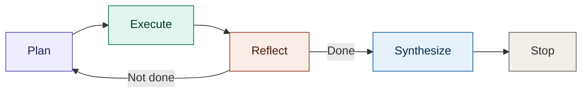

<h1 align="center">Hi, I'm Mohan G.C. 👋</h1>
<h3 align="center">Computer Engineer · Agentic AI Builder · Coding & Robotics Instructor</h3>

I teach 300+ students how to think in code — and I build autonomous AI agents that think for themselves.

---

### 🧠 My story

I'm a Computer Engineering student in Kathmandu. By day I teach Python and robotics to 300+ students at Bright Future Secondary School — breaking hard technical ideas down so 8th and 9th graders can build real things with them. That habit of "make it work, then make it clear" carries straight into my own projects.

Outside the classroom, I build **agentic AI systems** — software that doesn't just answer a prompt, but plans a task, executes it step by step, reflects on its own progress, and knows when to stop. My engineering thesis work included an **AI-based News Anchoring System**, and I've since gone deeper into building autonomous agents powered by Groq's LLaMA 3 inference.

- 🔭 Currently building: autonomous agents for research, note-taking, and personal knowledge management
- 🌱 Currently exploring: multi-agent orchestration and retrieval-augmented memory
- 🎓 Also teaching the next generation of Nepali engineers to code and build robots
- 📍 Based in Kathmandu, Nepal — open to AI/ML engineering roles

---

### ⚙️ How my agents think

Most of my projects follow the same control loop — an agent that plans before it acts, and knows when to stop:

**Plan** → break the goal into steps. **Execute** → run the next step with the right tool. **Reflect** → check progress against the goal, loop back if incomplete. **Synthesize** → compile results once the goal is met. **Stop** → don't keep spinning after the job's done.

---

### 🚀 Featured projects

| Project | What it does | Stack |
|---|---|---|
| [**Goal-Driven-Agent**](https://github.com/ermohangc07/Goal-Driven-Agent) — [🔴 Live demo](https://goal-driven-agent.streamlit.app) | Autonomous agent that runs a full Plan → Execute → Reflect → Synthesize → Stop loop on open-ended goals, without a human in the loop between steps | Python, Groq, LLaMA 3, Streamlit |
| [**Research-Agent**](https://github.com/ermohangc07/Research-Agent) | Takes a research question, breaks it into sub-questions, gathers and cross-checks information across sources, then synthesizes a single sourced answer | Python, LLaMA 3, Groq |
| [**personal-knowledge-agent**](https://github.com/ermohangc07/personal-knowledge-agent) | Turns a personal notes/document collection into a queryable knowledge base — retrieves relevant context before the model answers, instead of relying on memory alone | Python, RAG |
| [**ai-notes-memory**](https://github.com/ermohangc07/ai-notes-memory) | A memory layer for note-taking agents — persists what's been discussed across sessions so the agent doesn't start from zero every time | Python |
| [**groq-ai-file-editor**](https://github.com/ermohangc07/groq-ai-file-editor) | Lets an LLM propose and apply file edits directly, powered by Groq's low-latency inference — built for fast local iteration loops | Python, Groq |

> Each repo above should have its own README explaining the problem, the architecture, and a usage example — see the template I've set up for that.

---

### 🛠️ Tech stack

**Languages**

**AI / ML**

**Tools & deployment**

---

### 📊 GitHub stats

---

<i>Open to opportunities in AI engineering, agentic systems, and applied ML.</i>

