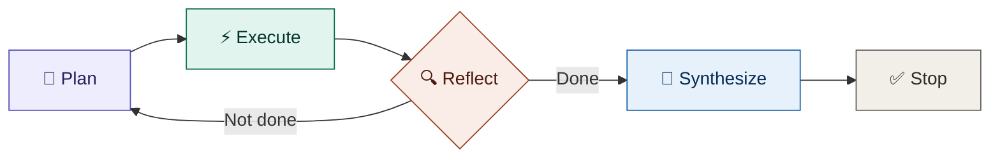

<div align="center">


<a href="https://git.io/typing-svg">
  
</a>

<br/>

<a href="https://www.linkedin.com/in/ermohangc07"></a>
<a href="https://goal-driven-agent.streamlit.app"></a>
<a href="https://www.tiktok.com/@er.mohangc07"></a>


</div>

<br/>

## 🧠 My story

I'm a Computer Engineering student in Kathmandu. By day I teach Python and robotics to **300+ students** at Bright Future Secondary School — breaking hard technical ideas down so 8th and 9th graders can build real things with them. That habit of *"make it work, then make it clear"* carries straight into my own projects.

Outside the classroom, I build **agentic AI systems** — software that doesn't just answer a prompt, but plans a task, executes it step by step, reflects on its own progress, and knows when to stop. My engineering thesis work included an **AI-based News Anchoring System**, and I've since gone deeper into building autonomous agents powered by Groq's LLaMA 3 inference.

```
🔭 Currently building   → autonomous agents for research, notes & personal knowledge management
🌱 Currently exploring  → multi-agent orchestration & retrieval-augmented memory
🎓 Also                 → teaching the next generation of Nepali engineers to code & build robots
📍 Based in             → Kathmandu, Nepal — open to AI/ML engineering roles
```

<br/>

## ⚙️ How my agents think

<div align="center">



</div>

Most of my projects follow the same control loop — an agent that plans before it acts, and knows when to stop. **Plan** → break the goal into steps. **Execute** → run the next step with the right tool. **Reflect** → check progress against the goal, loop back if incomplete. **Synthesize** → compile results once the goal is met. **Stop** → don't keep spinning after the job's done.

<br/>

## 🚀 Featured projects

<div align="center">

<table>
<tr>
<td width="50%" valign="top">

### 🎯 [Goal-Driven-Agent](https://github.com/ermohangc07/Goal-Driven-Agent)
[🔴 **Live demo**](https://goal-driven-agent.streamlit.app)

Autonomous agent that runs a full **Plan → Execute → Reflect → Synthesize → Stop** loop on open-ended goals, without a human in the loop between steps.

`Python` `Groq` `LLaMA 3` `Streamlit`

</td>
<td width="50%" valign="top">

### 🔬 [Research-Agent](https://github.com/ermohangc07/Research-Agent)

Takes a research question, breaks it into sub-questions, gathers and cross-checks information across sources, then synthesizes a single sourced answer.

`Python` `LLaMA 3` `Groq`

</td>
</tr>
<tr>
<td width="50%" valign="top">

### 🧠 [personal-knowledge-agent](https://github.com/ermohangc07/personal-knowledge-agent)

Turns a personal notes/document collection into a queryable knowledge base — retrieves relevant context before the model answers, instead of relying on memory alone.

`Python` `RAG`

</td>
<td width="50%" valign="top">

### 💾 [ai-notes-memory](https://github.com/ermohangc07/ai-notes-memory)

A memory layer for note-taking agents — persists what's been discussed across sessions so the agent doesn't start from zero every time.

`Python`

</td>
</tr>
<tr>
<td width="50%" valign="top">

### 📝 [groq-ai-file-editor](https://github.com/ermohangc07/groq-ai-file-editor)

Lets an LLM propose and apply file edits directly, powered by Groq's low-latency inference — built for fast local iteration loops.

`Python` `Groq`

</td>
<td width="50%" valign="top">

### 📄 AI Resume Screening System

Screens and ranks resumes against a job description, with an in-progress push toward multi-resume ranking and score explainability.

`Python` `Streamlit` `Gemini 2.5 Flash`

</td>
</tr>
</table>

</div>

> Each repo above should have its own README explaining the problem, the architecture, and a usage example — see the template I've set up for that.

<br/>

## 🛠️ Tech stack

<div align="center">

<br/><br/>


</div>

<br/>

## 📊 GitHub stats

<div align="center">


<br/>


<br/><br/>


</div>

<!--
  Note: the original github-readme-stats.vercel.app project is archived.
  The cards above use its actively maintained successor, github-stats-extended,
  plus streak-stats and activity-graph. If any of these stop rendering because
  the free demo instance is rate-limited or down, self-host via the "Deploy on
  Vercel" button in each project's repo — that gives you a stable URL that
  isn't sharing rate limits with the rest of GitHub.
-->

<br/>

## 🐍 Contribution snake

<div align="center">

</div>

<!--
  This animated snake is generated by a GitHub Actions workflow, not a static
  image — it eats your contribution graph once a day. To enable it:
  1. Add a workflow file (e.g. .github/workflows/snake.yml) using
     Platane/snk@v3 in your ermohangc07/ermohangc07 profile repo.
  2. It commits the generated SVG to an `output` branch automatically.
  3. Point the  src above at that branch, as shown.
  Until the workflow runs once, this image will 404 — that's expected on
  first setup.
-->

<br/>

<div align="center">

### 💬 *Open to opportunities in AI engineering, agentic systems, and applied ML.*


</div>
